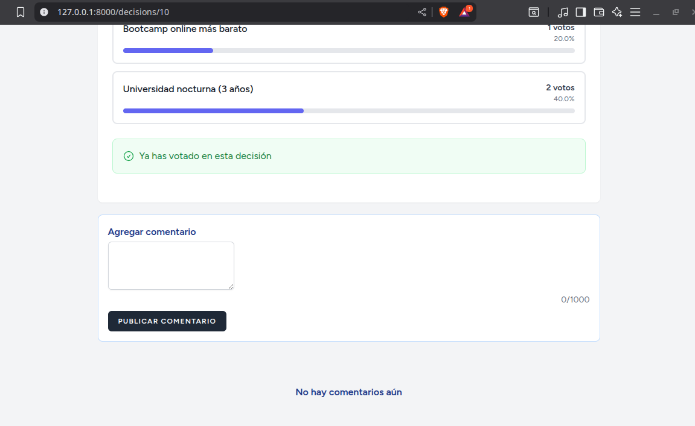
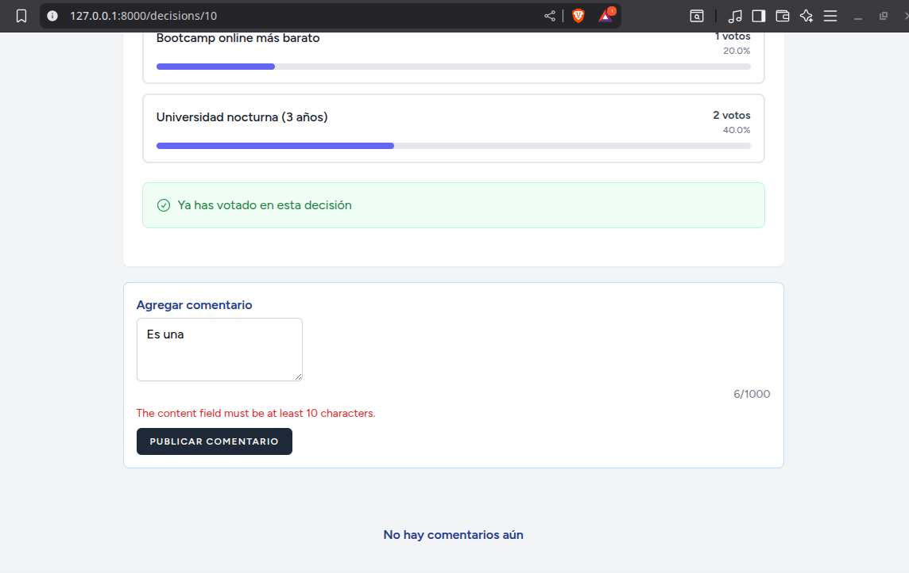
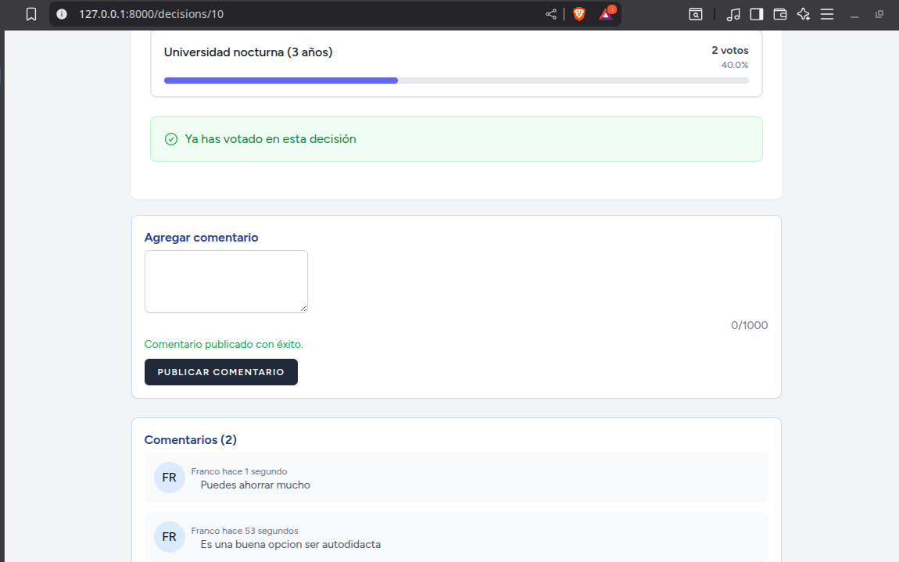

# Funcionalidad comentarios

En cada desicion puedes agregar comentarios.

## Componente al inicio cuando aún no hay comentarios

## Componente con validación desde el backend al no cumplir con lo caracteres necesarios

## Componente al hacer un comentario cumpliendo las validaciones con mensaje de exito

